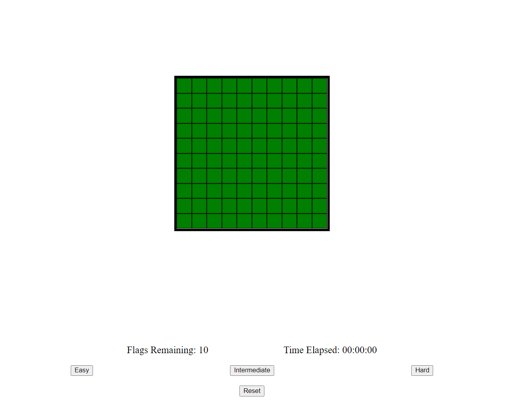

# Minesweeper

This project uses vanilla JavaScript, HTML, and CSS to create the game Minesweeper. There are three different modes to play in (Easy, Intermediate, Hard).

## How to download

To download, either git clone this repository, or download the zip file and extract the files.

## How to play

To play, open the html file in your preferred web browser. After, pick one of the modes to play (easy is automatically chosen).

- Left click : opens a spot (can either open a safe spot or mine)
- Right click: marked spot as flagged

To win the game, mark all the mines as flagged.
